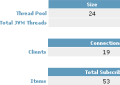

# Lightstreamer - Monitor Console Demo - HTML Client #

<!-- START DESCRIPTION lightstreamer-example-monitor-client-javascript -->

This project includes a simple HTML client front-end example for a monitor console application.

<table>
  <tr>
    <td style="text-align: left">
      &nbsp;<a href="http://demos.lightstreamer.com/MonitorDemo" target="_blank"></a>&nbsp;
      
    </td>
    <td>
      &nbsp;An online demonstration is hosted on our servers at:<br>
      &nbsp;<a href="http://demos.lightstreamer.com/MonitorDemo" target="_blank">http://demos.lightstreamer.com/MonitorDemo</a>
    </td>
  </tr>
</table>

This application shows a real-time monitor console. Several metrics are reported as they change on the server.<br>

The demo includes the following client-side functionalities:
* Three [Subscription](http://www.lightstreamer.com/docs/client_javascript_uni_api/Subscription.html)s containing the items for the statistics, subscribed to in <b>MERGE</b> mode feeding three [StaticGrid](http://www.lightstreamer.com/docs/client_javascript_uni_api/StaticGrid.html)s. Fields from a single item are associated to cells scattered in the page.
* Three [Subscription](http://www.lightstreamer.com/docs/client_javascript_uni_api/Subscription.html)s containing the items for the server logging, subscribed to in <b>DISTINCT</b> mode feeding three [DynaGrid](http://www.lightstreamer.com/docs/client_javascript_uni_api/DynaGrid.html)s.

<!-- END DESCRIPTION lightstreamer-example-monitor-client-javascript -->

# Deploy #

Before you can run the demo some dependencies need to be solved:

-  Get the lightstreamer.js file from the [latest Lightstreamer distribution](http://www.lightstreamer.com/download) 
   and put it in the "src/js" folder of the demo (if that is the case, please create it). Alternatively you can build a lightstreamer.js file from the 
   [online generator](http://www.lightstreamer.com/distros/Lightstreamer_Allegro-Presto-Vivace_5_1_1_Colosseo_20130305/Lightstreamer/DOCS-SDKs/sdk_client_javascript/tools/generator.html).
   In that case be sure to include the LightstreamerClient, Subscription, DynaGrid, StaticGrid and StatusWidget modules and to use the "Use AMD" version.
-  Get the require.js file form [requirejs.org](http://requirejs.org/docs/download.html) and put it in the "src/js" folder of the demo.
-  Get the zip file from [script.aculo.us](http://script.aculo.us/downloads) and put the prototype.js, scriptaculous.js, and slider.js files in the "src/js/scriptaculous" folder of the demo.

You can deploy this demo in order to use the Lightstreamer server as Web server or in any external Web Server you are running. 
If you choose the former case please note that in the <LS_HOME>/pages/demos/ folder there is a copy of the /src directory of this project, if this is non your case please create the folders <LS_HOME>/pages/demos/MessengerDemo then copy here the contents of the /src folder of this project.<br>
The client demo configuration assumes that Lightstreamer Server and this client are launched on the same machine. If you need to targeting a different Lightstreamer server please search this line:
```js
var lsClient = new LightstreamerClient(protocolToUse+"//localhost:8080","MONITORDEMO");
```
in js/lsClient.js file and change it accordingly.<br>

Note also that this demo is a very special case since does not need any specific adapters, but through the special "MONITOR" name, the internal monitoring Data Adapter provided by Lightstreamer Server is loaded.
The Metadata Adapter functionalities are absolved by the `LiteralBasedProvider` in [Lightstreamer - Reusable Metadata Adapters - Java Adapter](https://github.com/Weswit/Lightstreamer-example-ReusableMetadata-adapter-java), a simple full implementation of a Metadata Adapter, made available in Lightstreamer distribution. 
In order to run the demo you just need to create a new folder to configure the adapters, let's call it "MonitorDemo", inside the "adapters" folder of your \LS_HOME dir and add a "adapters.xml" configuration file like this: 

```xml
<?xml version="1.0"?>

<!-- Mandatory. Define an Adapter Set and sets its unique ID. -->
<adapters_conf id="MONITORDEMO">

    <!-- Mandatory. Define the Metadata Adapter. -->
    <metadata_provider>

        <!-- Mandatory. Java class name of the adapter. -->
        <adapter_class>com.lightstreamer.adapters.metadata.LiteralBasedProvider</adapter_class>

        <!-- Optional.
             See LiteralBasedProvider javadoc. -->
        <!--
        <param name="max_bandwidth">40</param>
        <param name="max_frequency">3</param>
        <param name="buffer_size">30</param>
        <param name="distinct_snapshot_length">10</param>
        <param name="prefilter_frequency">5</param>
        <param name="allowed_users">user123,user456</param>
        -->

        <!-- Optional.
             See LiteralBasedProvider javadoc. -->
        <param name="item_family_1">monitor_log_.*</param>
        <param name="modes_for_item_family_1">DISTINCT</param>
        
        <param name="item_family_2">monitor_.*</param>
        <param name="modes_for_item_family_2">MERGE</param>
        
    </metadata_provider>

    <!-- Mandatory. Define the Data Adapter. -->
    <data_provider name="MONITOR">

        <!-- Mandatory. Java class name of the adapter.
             Through the special "MONITOR" name, the internal monitoring Data
             Adapter provided by Lightstreamer Server is loaded. -->
        <adapter_class>MONITOR</adapter_class>

    </data_provider>

</adapters_conf>
```

The factory configuration of Lightstreamer server already provides this adapter deployed.<br>
The demo are now ready to be launched.

# See Also #

## Lightstreamer Adapters needed by this demo client ##
<!-- START RELATED_ENTRIES -->

* MONITOR. Through the special "MONITOR" name, the internal monitoring Data Adapter provided by Lightstreamer Server is loaded.

<!-- END RELATED_ENTRIES -->

## Similar demo clients that may interest you ##

* [Lightstreamer - Stock-List Demos - HTML Clients](https://github.com/Weswit/Lightstreamer-example-Stocklist-client-javascript)
* [Lightstreamer - Chat Demo - HTML Client](https://github.com/Weswit/Lightstreamer-example-Chat-client-javascript)
* [Lightstreamer - Portfolio Demos - HTML Clients](https://github.com/Weswit/Lightstreamer-example-Portfolio-client-javascript)

# Lightstreamer Compatibility Notes #

- Compatible with Lightstreamer JavaScript Client library version 6.0 or newer.
