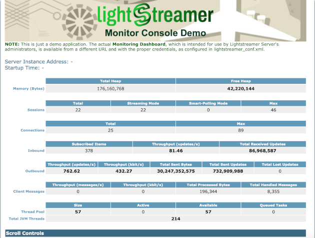

# Lightstreamer - Monitor Console Demo - HTML Client

<!-- START DESCRIPTION lightstreamer-example-monitor-client-javascript -->
The *Monitor Console Demo* is a monitor console application based on Lightstreamer for its real-time communication needs.

This project includes a HTML client front-end for the *Basic Messenger Demo*.

As an example of [Lightstreamer Adapters Needed by This Client](https://github.com/Weswit/Lightstreamer-example-Monitor-client-javascript#lightstreamer-adapters-needed-by-this-client), you may refer to the internal monitoring Data Adapter provided by Lightstreamer Server.

## Live Demo

[](http://demos.lightstreamer.com/MonitorDemo)

###[ View live demo](http://demos.lightstreamer.com/MonitorDemo)

## Details

This application shows a real-time monitor console. Several metrics are reported as they change on the server.

The demo includes the following client-side functionalities:
* Three [Subscription](http://www.lightstreamer.com/docs/client_javascript_uni_api/Subscription.html)s containing the items for the statistics, subscribed to in <b>MERGE</b> mode feeding three [StaticGrid](http://www.lightstreamer.com/docs/client_javascript_uni_api/StaticGrid.html)s. Fields from a single item are associated to cells scattered in the page.
* Three [Subscription](http://www.lightstreamer.com/docs/client_javascript_uni_api/Subscription.html)s containing the items for the server logging, subscribed to in <b>DISTINCT</b> mode feeding three [DynaGrid](http://www.lightstreamer.com/docs/client_javascript_uni_api/DynaGrid.html)s. 

### Dig the Code

#### The Adapter Set Configuration

This demo is a very special case because does not need any specific adapters, but through the special "MONITOR" name, the internal monitoring Data Adapter provided by Lightstreamer Server is loaded.
The factory configuration of Lightstreamer server already provides this adapter deployed.

The Metadata Adapter functionalities are absolved by the `LiteralBasedProvider` in [Lightstreamer - Reusable Metadata Adapters - Java Adapter](https://github.com/Weswit/Lightstreamer-example-ReusableMetadata-adapter-java), a simple full implementation of a Metadata Adapter, already provided by Lightstreamer server. 

To run the demo you just need to have a folder, let's call it `MonitorDemo`, inside the `<LS_HOME>/adapters` folder of your Lightstreamer Server installation and inside it an `adapters.xml` configuration file like this: 

```xml
<?xml version="1.0"?>

<!-- Mandatory. Define an Adapter Set and sets its unique ID. -->
<adapters_conf id="MONITORDEMO">

    <!-- Mandatory. Define the Metadata Adapter. -->
    <metadata_provider>

        <!-- Mandatory. Java class name of the adapter. -->
        <adapter_class>com.lightstreamer.adapters.metadata.LiteralBasedProvider</adapter_class>

        <!-- Optional.
             See LiteralBasedProvider javadoc. -->
        <!--
        <param name="max_bandwidth">40</param>
        <param name="max_frequency">3</param>
        <param name="buffer_size">30</param>
        <param name="distinct_snapshot_length">10</param>
        <param name="prefilter_frequency">5</param>
        <param name="allowed_users">user123,user456</param>
        -->

        <!-- Optional.
             See LiteralBasedProvider javadoc. -->
        <param name="item_family_1">monitor_log_.*</param>
        <param name="modes_for_item_family_1">DISTINCT</param>
        
        <param name="item_family_2">monitor_.*</param>
        <param name="modes_for_item_family_2">MERGE</param>
        
    </metadata_provider>

    <!-- Mandatory. Define the Data Adapter. -->
    <data_provider name="MONITOR">

        <!-- Mandatory. Java class name of the adapter.
             Through the special "MONITOR" name, the internal monitoring Data
             Adapter provided by Lightstreamer Server is loaded. -->
        <adapter_class>MONITOR</adapter_class>

    </data_provider>

</adapters_conf>
```

<!-- END DESCRIPTION lightstreamer-example-monitor-client-javascript -->
## Install
If you want to install a version of this demo pointing to your local Lightstreamer Server, follow these steps:
* As prerequisite, a Lightstreamer Server has to be deployed. Download *Lightstreamer Server* (Lightstreamer Server comes with a free non-expiring demo license for 20 connected users) from [Lightstreamer Download page](http://www.lightstreamer.com/download.htm), and install it, as explained in the `GETTING_STARTED.TXT` file in the installation home directory.
* Get the `deploy.zip` file of the [latest release](https://github.com/Weswit/Lightstreamer-example-Monitor-client-javascript/releases), unzip it, and copy the just unzipped `MonitorDemo` folder into the `adapters` folder of your Lightstreamer Server installation.
* Download this project.
* Launch Lightstreamer Server.
* Get the `lightstreamer.js` file from the [latest Lightstreamer distribution](http://www.lightstreamer.com/download) and put it in the `src/js` folder. 
Alternatively, you can build a `lightstreamer.js` file from the [online generator](http://www.lightstreamer.com/docs/client_javascript_tools/generator.html). In that case, be sure to include the LightstreamerClient, Subscription, DynaGrid, and StatusWidget modules and to use the "Use AMD" version.
* Get the `require.js` file form [requirejs.org](http://requirejs.org/docs/download.html) and put it in the `src/js` folder.
* Get the zip file from [script.aculo.us](http://script.aculo.us/downloads) and put the `prototype.js`, `scriptaculous.js`, and `slider.js` files in the `src/js/scriptaculous` folder of the demo.
* Deploy this demo on the Lightstreamer Server (used as Web server) or in any external Web Server. If you choose the former, please note that in the `<LS_HOME>/pages/demos/` folder, there may be already a `MonitorDemo` folder. If this is not your case, please create the folders `<LS_HOME>/pages/MonitorDemo` and copy here the contents of the `/src` folder of this project.
The client demo configuration assumes that Lightstreamer Server, Lightstreamer Adapters, and this client are launched on the same machine. If you need to target a different Lightstreamer server, please search in `js/lsClient.js` this line:<BR/> 
`var lsClient = new LightstreamerClient(protocolToUse+"//localhost:"+portToUse,"MONITORDEMO");`<BR/> 
and change it accordingly.
* Open your browser and point it to: [http://localhost:8080/MonitorDemo/](http://localhost:8080/MonitorDemo/)

## See Also

### Lightstreamer Adapters Needed by This Client
<!-- START RELATED_ENTRIES -->

* MONITOR. Through the special "MONITOR" name, the internal monitoring Data Adapter provided by Lightstreamer Server is loaded.

<!-- END RELATED_ENTRIES -->

### Related Projects

* [Lightstreamer - Stock-List Demos - HTML Clients](https://github.com/Weswit/Lightstreamer-example-Stocklist-client-javascript)
* [Lightstreamer - Chat Demo - HTML Client](https://github.com/Weswit/Lightstreamer-example-Chat-client-javascript)
* [Lightstreamer - Portfolio Demos - HTML Clients](https://github.com/Weswit/Lightstreamer-example-Portfolio-client-javascript)

## Lightstreamer Compatibility Notes

- Compatible with Lightstreamer JavaScript Client library version 6.0 or newer.
